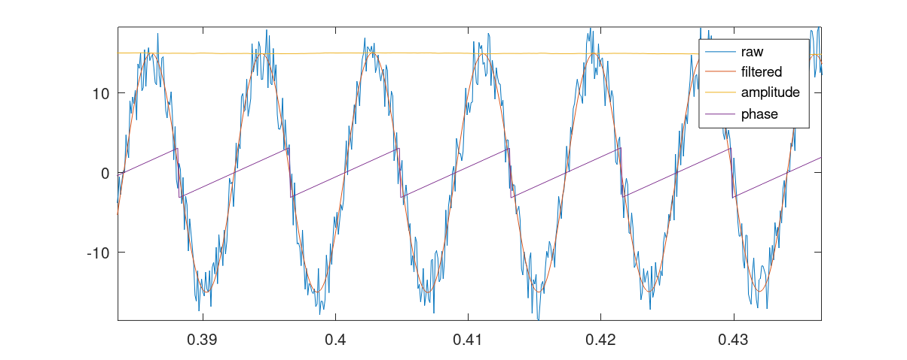

# LuenbergerPLL

TLDR: A Luenberger observer to track a sine wave in a noisy environment

This routine, written in C, allows tracking a sine wave subject to various disturbances and provides clean values, amplitude, and phase. It can also be used to retrieve signals in phasor form from measurements.

## Repository content

This repository contains the files [LPLL.h](LPLL.h) and [LPLL.c](LPLL.c) that provides the following struct:

<pre><code>
struct LPLL_SS
{
    double A[2][2]; 
    double B[2]; 
    double C[2][2];
    double D[2];
};
</pre></code>

This struct contains the discrete time filter parameters.

There is also a function:

<pre><code>
struct LPLL_SS LPLL_filterDesign(double f0, double BW, double dt);
</pre></code>

This function allows you to design a filter and accepts an expected sine wave frequency $f_0$ in Hz, the filter bandwidth $BW$ in Hz, and the sampling time $dt$ in seconds as inputs.

The filter will track the sin wave from its measurement. You can choose the bandwidth $BW$ to set an uncertainty level on the sine wave frequency $f_0$. Please note, the wider the bandwidth, the more time the observer will need to converge to the sine wave.

The function

<pre><code>
void LPLL_step(const struct LPLL_SS *ss, double x[], double u, double y[]) 
</pre></code>

allows you to filter the the signal $u_k$ that is your measurement and obtain an output vector $\underline y$. These are two outputs of the filter, which represent the reconstruction of the two coordinates of a rotating vector that is generating the wave you're measuring. The digital filter's 2-element state $\underline x$ must be passed to the filter at each iteration.

You can see the [LPLL_test](LPLL_test.c) as example.

## Derivation

We begin with the model of a generic vector rotating in the $x_1$, $x_2$ plane with angular speed $\omega$, and amplitude $\rho$:

$$ x_1(t) = \rho \cdot cos(\omega t + \varphi_0) $$

$$ x_2(t) = \rho \cdot sin(\omega t + \varphi_0) $$

We differentiate the state $\underline x$ to obtain an ODE that drives the vector in the plane:

$$ \frac{d}{dt}x_1(t) = -\rho \cdot \omega \cdot sin(\omega t + \varphi_0) = -\omega \cdot x_2(t)$$

$$ \frac{d}{dt}x_2(t) = \rho\cdot \omega \cdot cos(\omega t + \varphi_0) = \omega \cdot x_1(t)$$

In matrix form, defining an output $y$ we can define

$$
\frac{d}{dt} 
\begin{bmatrix} 
x_1(t) \\
x_2(t) 
\end{bmatrix}  =
\begin{bmatrix}
0 & -\omega \\ 
\omega & 0
\end{bmatrix}
\begin{bmatrix}
x_1(t) \\ 
x_2(t)
\end{bmatrix}
$$

$$
y = 
\begin{bmatrix}
1 & 0
\end{bmatrix}
\begin{bmatrix}
x_1(t) \\
x_2(t)
\end{bmatrix}
$$

$$
\begin{matrix}
A_c \triangleq 
\begin{bmatrix}
0 & -\omega \\ 
\omega & 0
\end{bmatrix}
& &
C_c \triangleq
\begin{bmatrix}
1 & 0
\end{bmatrix}
\end{matrix}
$$

Note that the system parameters are independent of the variable $\rho$. The information about this variable is contained within the state $\underline x$.

$$ \rho = \sqrt{x_1^2 + x_2^2} = \sqrt{\underline x^T \underline x} $$

and the instantaneous phase is

$$ \varphi = atan2(x_2, x_1) $$

Now, we can design an observer to estimate the two states. We choose a [Luenberger Observer](https://en.wikipedia.org/wiki/State_observer) for reasons that will become clear later. We augment the evolution equation with the $L$ gains matrix

$$ \frac{d}{dt} \underline x(t) = A_c \cdot \underline x(t) - L(C_c \underline x(t) - y_m(t)) $$

Where $y_m$ is the measured output.

We define the closed loop update matrix 

$$ A_{cl} \triangleq A_c - L C $$

To allow the observer to converge we must define a $L$ matrix such that $A_{cl}$ is Hurwitz. Instead of looking for stable eigenvalues we can observe that if we choose an $L$ matrix in the family 

$$ 
L = 
\begin{bmatrix} 
0 
\\ 
\frac{\omega}{Q} 
\end{bmatrix} 
$$

for some $Q$, the closed loop matrix becomes:

$$ A_{cl} = 
\begin{bmatrix}
0 & -\omega \\
\omega & -\frac{\omega}{Q}
\end{bmatrix}
$$

it can be shown that exists a particular basis where $A_{cl}$ is a state update matrix for a second-order analog bandpass filter with quality factor $Q$. The $A_{cl}$ is Hurwitz because we know from filter theory that the second-order bandpass filter is stable. The quality factor is defined as:

$$ Q \triangleq \frac{f_0}{BW} $$

Where $f_0 = \frac{\omega}{2 \pi}$ and $BW$ is the filter band in $Hz$. So with this $L$ family, the Luenberger observer become a second-order bandpass filter in the coordinate system we initially choose.
This is very useful, meaning we can tune the observer simply by choosing a bandwidth that we can interpret as the uncertainty we have on the central pulsation $\omega$ that we use for the mathematical system model.

The analog filter model will be:

$$ \frac{d}{dt} \underline x(t) = A_{cl} \cdot \underline x(t) + L\cdot y_m(t) $$

$$ \underline h(t) = C_I \cdot \underline x(t) $$

$\underline h(t)$ is the output of the filter. We've defined a SIMO (Single Input Multiple Outputs) filter such that $\underline h(t) = \underline x(t)$ so $C_I$ is the identity matrix. This will be useful for the discretization step, which allows us to implement the filter algorithmically.

To obtain good observation performance in the discrete domain, we will discretize the fileter using the [Bilinear Transform](https://en.wikipedia.org/wiki/Bilinear_transform) with prewarping at the $f_0$ frequency. This can be see as a map from Laplace to z-transform domain such that:

$$ s \leftarrow \frac{\omega}{\tan(\omega \Delta T/2)}\cdot\frac{z-1}{z+1} $$

Where $\Delta T$ is the sampling time of the digital system. The prewarping allows the transfer function of the digital filter to match the one of the analog filter at the central frequency $f_0$.

In the matrix state space representation, this transform becomes: 

$$
\begin{matrix} 
\alpha \triangleq \frac{\omega}{\tan(\omega \Delta T/2)} & 
I \triangleq \left(I_d - \frac{1}{\alpha} A_{cl}\right)^{-1} 
\end{matrix}
$$

$$
\begin{matrix} 
A_d = \left(I_d +\frac{1}{\alpha} A_{cl}\right) I & B_d = \sqrt{\frac{2}{\alpha}} I \cdot L \\
C_d = \sqrt{\frac{2}{\alpha}} C_I I & D_d = D_I +\frac{1}{\alpha} C_I 
\end{matrix}
$$

where $I_d$ is the identity matrix and $D_I$ the feed-forward term of the analog filter that is equal to $\underline 0$.

The digital filter equations are

$$ \underline x_{k+1} = A_d \cdot \underline x_k + B_d \cdot {y_m}_k $$

$$ \underline h_k = C_d \cdot \underline x_k + D_d \cdot {y_m}_k $$

The reconstruction of the state of the rotating vector at the instant $k$ will be the $\underline h_k$ vector.

## Graphical example
[otavePlotter.m](octavePlotter.m) provides an *Octave* script to plot the output of [LPLL_test](LPLL_test.m):

You can see that the observer converge to the sine wave and allow you to estimate the cleaned sin wave, the amplitude $\rho$ and the instantaneous phase. 

## Phasor form estimation
In a steady-state circuit analysis using the [Steinmetz transform](https://en.wikipedia.org/wiki/Phasor), it's common to convert time domain sine wave signals in phasor form:

$$
\rho \cdot cos(\omega t + \varphi_0) \rightarrow \frac{\rho}{\sqrt 2} e^{j \varphi_0}
$$

The *LPLL* filter allows you to estimate phasors. In fact you can derive $\rho$ as 

$$ \rho = \sqrt{\underline h^T \underline h} $$

However, you don't know the initial phase $\varphi_0$. What you really need is the phase displacement of signals. Hence, you need to choose a reference system for the phases, forcing a signal to have  $\varphi_0 = 0$. Then, you can easily calculate the phase displacement from the reference signal using the following trigonometric identity:

$$
tan(a - b) = \frac{sin(a) cos(b) - cos(a) sin(b)}{sin(a) sin(b) + cos(a)cos(b)}
$$

If we have two signals and one of the previous filter for each signal, we get a pair $\underline h_1$ and $\underline h_2$ of outputs.

When the identity is applied to the filter output, we obtain

$$
\frac{{h_2}_2 {h_1}_1 - {h_2}_1 {h_1}_2}{{h_2}_1 {h_1}_1 - {h_2}_2 {h_1}_2} =
\frac{\rho_1 \rho_2}{\rho_1 \rho_2} tan(\varphi_2 - \varphi_1) = 
tan(\varphi_2 - \varphi_1)
$$

Thus, we can observe that
$$
\Delta \varphi = atan2({h_2}_2 {h_1}_1 - {h_2}_1 {h_1}_2, {h_2}_1 {h_1}_1 - {h_2}_2 {h_1}_2)
$$

The phasor form of the two signals will then be

$$ F_1 =  \frac{\rho_1}{\sqrt 2}e^{j0} =  \frac{\rho_1}{\sqrt 2} $$

$$ F_2  = \frac{\rho_2}{\sqrt 2}e^{j \Delta \varphi}  $$